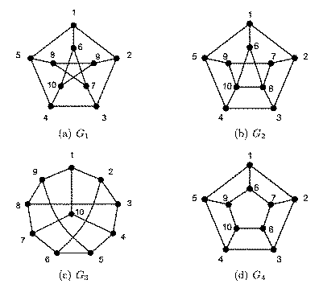
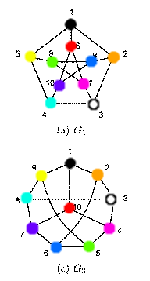

Graph Theory
============

Problem 1
---------

**Let** :math:`\ G = (V, E)\ ` **be a graph.**
**A matching in G is a set** :math:`\ M \subset E\ ` **such that no two edges in M are incident on a common vertex.**

**Let** :math:`\ M_1, M_2\ ` **be two matchings of G.**
**Consider the new graph** :math:`\ G' = (V, M_1 \cup M_2)`
**(i.e. on the same vertex set, whose edges consist of all the edges that appear in either** :math:`\ M_1` **or** :math:`\ M_2` **).**

**Show that** :math:`\ G'\ ` **is bipartite.**

**Helpful definition: A connected component is a subgraph of a graph consisting of some vertex and every node and edge that is connected to that vertex.**

.. raw:: html

	

Suppose we have two subsets of nodes, :math:`V_L` and :math:`V_R`, where :math:`V = V_L \cup V_R`.
:math:`G'` is bipartite if every node can be added to either :math:`V_L` or :math:`V_R` without sharing an edge with an existing node in that set.

By definition, a matching produces a bipartite graph, because no two edges are incident to a common vertex.
A graph produced from a matching also has a maximum degree of 1, for the same reason.

If :math:`G'` has a degree of 1, then it is trivially bipartite.
So we must show that :math:`G'` is bipartite if it has a degree higher than 1.

**Lemma 1**: :math:`G'` has a maximum degree of 2.

**Proof**: By contradiction.
Suppose we have a node, v, in :math:`G'` incident to edges :math:`e_t` where :math:`\ t > 2`.
By definition of a matching, the vertex (and the edge it is matched with) can appear once and only once per matching.
We also know the edges in :math:`G'` are a union of exactly two matchings.

So, if t is greater than 2, :math:`e_1` and :math:`e_2` could come from :math:`M_1` and :math:`M_2` respectively,
but :math:`e_3` could not come from either, which is a contradiction.

So we can conclude a graph produced from two matchings will have, at most, degree of 2.
:math:`\square`

Next, let's consider the connected component of any node in :math:`G'`.
Suppose we have a node, v, connected by the shortest number of edges to another node, u.
We start by adding v to :math:`V_L`, and for every node in the same component we recursively add every adjacent node to the opposite partition.
This means the number of edges from v to any node in :math:`V_L` will be even, and the number of edges from v to any node in :math:`V_R` will be odd.

A path is bipartite, because each node is present only once, and there are no cycles.
So each node can be grouped by the opposite of its neighbours.

Suppose two adjacent nodes, w and x are both connected to v, forming a cycle :math:`v—...w—x—...v`.

If the parity of :math:`v—..w` and :math:`v—...x` is different,
then by the above, w and x are in opposite partitions, so the cycle is bipartite.

.. note::

	The sum of numbers of opposite parity is odd, plus 1 (for the edge :math:`w—x`),
	meaning this is a cycle of even length.

If the parity of :math:`v—..w` and :math:`v—...x` is the same, then w and x would be in the same partition.
But since they share an edge they can't be added to the same partition, and so the graph cannot be bipartite.

.. note::

	The sum of any two numbers of the same parity is always even.

Since v and w are adjacent, the parity of the number of edges in the the cycle :math:`v—...w—x—...v` is odd.
So we must prove that :math:`G'` cannot have any cycles of odd length.

**Lemma 2**: :math:`G'` cannot have any cycles of odd length

**Proof**: By contradiction.
Assume :math:`G'` has a cycle of length i, where i is an odd number.
Suppose we walk around the cycle. Since the edges in :math:`G'` are a union of matchings,
each step must travel along an edge, e, such that :math:`e_j` and :math:`e_{j+1}` are from the opposite matching,
for some integer :math:`j \in \Bbb Z`.

This is because matchings cannot contain edges connected to a node more than once.
So if a node has more than one edge, they must come from different matchings.

.. note::

	By lemma 1, we know there are at most 2 edges for every node in :math:`G'`.
	So edges are from either :math:`M_1` or :math:`M_2`.

This means, for any :math:`k,m \in \Bbb Z`, if :math:`\ k\ mod\ i\ ` and :math:`\ m\  mod\ i\ ` are both even, then they must come from the same matching.
However, since i is odd, :math:`\ 0\ mod\ i\ ` and :math:`\ i-1\ mod\ i\ ` are both even, which would put two adjacent edges in the same matching.
This is a contradiction, so we can assume there are no cycles of odd length in :math:`G'`
:math:`\square`

By lemma 2, we know :math:`G'` can only be comprised of paths and even cycles, which as we showed, both result in a bipartite graph.
Therefore, :math:`G'` is bipartite.
:math:`\blacksquare!`

Problem 2
---------

**Let** :math:`\ G = (V, E)\ ` **be a graph.**
**Recall that the degree of a vertex** :math:`v \in V\ ` **, denoted** :math:`\ d_v\ ` **, is the number of vertices w such that there is an edge between v and w.**

**(a) Prove that**

.. math::

	2 |E| = \sum_{v \in V} d_v

.. raw:: html

	

Every edge in a graph connects one node to another.
In all of these examples we are also assuming simple graphs, i.e. no loops or multi-edges.

Let's say one of the nodes in G, :math:`v_a`, is connected by an edge to another node, :math:`v_b`.
When we count the degree of :math:`v_a` we get :math:`d_a`, which includes the edge :math:`{v_a—v_b}`
When we come to count the degree of :math:`v_b` we get :math:`d_b`, and this includes the edge :math:`{v_b—v_a}`.

In this way, each edge is counted twice.
Therefore the sum of all the degrees of :math:`v \in V` is equal to the number of edges multiplied by two.

**(b) At a 6.042 ice cream study session (where the ice cream is plentiful and it helps you study too) 111 students showed up.**
**During the session, some students shook hands with each other**
**(everybody being happy and content with the ice-cream and all).**
**Turns out that the University of Chicago did another spectacular study here,**
**and counted that each student shook hands with exactly 17 other students.**
**Can you debunk this too?**

.. raw:: html

	

Let :math:`G = (V, E)` be a graph representing the ice cream sticky study shakey handathon session.
Where each node in V represents a student, and each edge in E represents students :math:`v_a` and :math:`v_b` shaking hands with each other.

**Theorem**: There cannot exist a graph where each node in V is connected by 17 edges.

**Proof**: By contradiction.

Suppose each student shook hands with 17 other students.
There are 111 students in total multiplied by 17 students = 1887 hand shakes in total.
But a handshake is reciprocal, so to avoid counting it twice we must divide by 2.
But we can't divide 1887 by 2 because it's an odd number.
This is contradiction, so we can conclude that the theorem holds.
:math:`\blacksquare`

**(c) And on a more dull note, how many edges does** :math:`\ K_n\ ` **, the complete graph on n vertices, have?**

.. raw:: html

	

In an n-node complete graph, every node is connected to every other node.
Again, we're only considering simple graphs, so no loops or multi-edges.

This means for each node there are :math:`n - 1` edges.
Since there are n nodes, then there are :math:`n \cdot (n - 1)` edges.
However, that would count edges going both ways, so we need to divide by 2,
giving us :math:`{n^2 - n \over 2}`.

**Theorem**: Let P(n) be the predicate, defined as follows,

.. math::

	P(n) ::= \forall n \in N_+.\ |E| = {n^2 - n \over 2}

That is, for any n-node complete graph :math:`G = (V, E)`, the number of edges is calculated as above.

**Base Case**: P(1) is true because, there is only one node and we don't allow loops so there can be zero edges

.. math::

	{1^2 - 1 \over 2} = 0

**Inductive Step**: We must show :math:`P(n + 1)`, assuming :math:`P(n)` is true.
First, if we take out the :math:`(n+1)^{th}` node, and all its edges, we are left with a n-node graph.
By P(n) we can assume how many edges it has.
When we add the :math:`(n+1)^{th}` node back in, it must be connect to all existing nodes to make a complete graph.
There are n existing nodes, so we can calculate the number of edges as,

.. math::

	\begin{aligned}

	|E| &= {n^2 - n \over 2} + n \qquad && \text{ (by inductive hypothesis) } \cr

	&= {n^2 - n \over 2} + {2n \over 2} \qquad && \text{ (multiply to common factor)} \cr

	&= {n^2 - n + 2n \over 2} \cr

	&= {(n+1) \cdot n \over 2} \cr

	\end{aligned}

This proves :math:`P(n+1)`, and so by induction we can assume the hypothesis is true for all :math:`n \in N_+`.
:math:`\blacksquare`

Problem 3
---------

**Two graphs are isomorphic if they are the same up to a relabeling of their vertices (see Definition 5.1.3 in the book).**
**A property of a graph is said to be preserved under isomorphism if whenever G has that property,**
**every graph isomorphic to G also has that property.**
**For example, the property of having five vertices is preserved under isomorphism:**
**if G has five vertices then every graph isomorphic to G also has five vertices.**

**Some properties of a simple graph, G, are described below.**
**Which of these properties is preserved under isomorphism?**

1.  **G has an even number of vertices.**

	.. raw:: html

		

	Preserved, because isomorphism is a bijection between sets of vertices, so the number of vertices cannot change.
	If the graph has an even number before applying to function, it will have an even number after applying.

2.  **None of the vertices of G is an even integer.**

	.. raw:: html

		

	Not preserved, because the graph isomorphism could be to simply add one, making it odd.

3.  G has a vertex of degree 3.

	.. raw:: html

		

	Preserved, because the function applied to each vertex is also applied to each vertex adjacent to it.

4. G has exactly one vertex of degree 3.

	.. raw:: html

		

	Preserved, for the same reason as in question 3

**Determine which among the four graphs pictured in the Figures are isomorphic.**
**If two of these graphs are isomorphic, describe an isomorphism between them.**
**If they are not, give a property that is preserved under isomorphism such that one graph has the property, but the other does not.**
**For at least one of the properties you choose, prove that it is indeed preserved under isomorphism (you only need prove one of them).**

Graphs a and c are isomorphic.

Here is an isomorphism from a to c:

.. math::

	f(1) = 1

	f(2) = 2

	f(3) = 3

	f(4) = 8

	f(5) = 9

	f(6) = 10

	f(7) = 4

	f(8) = 5

	f(9) = 6

	f(10) = 7

To make this a bit more visual, I've labelled these with colours:

Graph b is not isomorphic to any other, because it has a max degree of 4, but the others all have a max degree of 3.

Graph d is not isomorphic to any other because it has a cycle of length 4, but neither a nor b have a cycle of length 4.
(We already showed b is not isomorphic to d because of the max degree).

The formal definition of isomorphism between two graphs G and H is a bijection :math:`\ f\ :\ V(G) \rightarrow V(H)` such that,

.. math::

	\langle u — v \rangle \in E(G) \Leftrightarrow \langle f(u) — f(v) \in E(H) \rangle

for all :math:`u, v \in V(G)`

This means an isomorphic function is applied to any given node in G to get the corresponding node in H.
It also means the edge between any two nodes in G is also preserved in H.

That is to say, if u is adjacent to v in G, then :math:`f(u)` is adjacent to :math:`f(v)` in H.
This means the number of edges does not increase or decrease while performing the isomorphism.

Since the number of edges does not change, it follows that the max degree must also remain the same.
