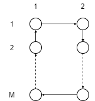
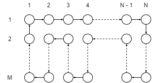
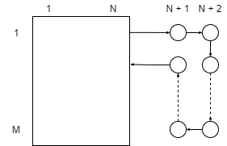
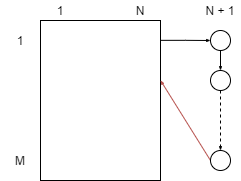
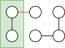
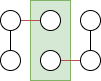

More Graph Theory
=================

Problem 1
---------

.. admonition:: Introduction

	Recall that a tree is a connected acyclic graph.
	In particular, a single vertex is a tree.
	We define a Splitting Binary Tree, or SBTree for short, as either the lone vertex, or a tree with the following properties:

		1. exactly one node of degree 2 (called the root).

		2. every other node is of degree 3 or 1 (called internal nodes and leaves, respectively).

	For the case of one single vertex (see above), that vertex is considered to be a leaf.

a)
^^

.. admonition:: Question

	Show if an SBTree has more than one vertex, then the induced subgraph obtained by removing the unique root consists of two disconnected SBTrees.
	You may assume that by removing the root you obtain two separate connected components,
	so all you need to prove is that those two components are SBTrees.

An SBTree is a recursive structure that has one transition, split.
Split can only be applied to nodes with at most one edge.
Suppose we have a node, n, that we apply the split transition to.

.. graph:: split_before
	:align: center

	r [style=invis]
	n [color=lightblue style=filled]

	r -- n [style=dotted]

Notice that n may or may not be connected to another node at a level higher.
This is because if n is the root node, then no such edge exists, but the split transition can still be applied to it.

The split transition adds 2 new nodes to the graph, o and p,
and then adds an edge between them and n.

.. graph:: split_after
	:align: center

	r [style=invis]
	n [color=lightblue style=filled]
	o, p [color=indianred style=filled]

	r -- n [style=dotted]
	n -- o
	n -- p

If n was the root node, then the dotted edge does not exist, and it now has a degree of 2.
If n wasn't the root node, then it has a degree of 3.
Either way, its degree is higher than 1, so it can no longer be further split.

Notice also that the new nodes, o and p, has a degree of 1, so they can be split further.
When we do so, splitting does not remove any edges, only increases the total number of edges by 2.

An invariant of the SBTree is that the total number of edges always has even parity.
Our base case is the root node, which has parity 0, which is even.
As we showed above, applying the split transition increases the number of edges by 2,
so will always result in an even total number of edges.

Suppose n was the root node. If we were to remove it, and the incident edges, we would be left with o and p.

.. graph:: remove_root
	:align: center

	n [color=lightblue style=invis]
	o, p [color=indianred style=filled]

	n -- o [style=invis]
	n -- p [style=invis]

As you can see, both o and p have degree less than 1, so they could be split, following the same process as above.
Notice also, they have degree 0, and so maintains our invariant of even parity for total number of edges.
Thus o and p are both SBTrees.

Suppose the graph has had any number of transitions applied after this transition.
As showed above, the total number of nodes increases by 2 for each split.
Since the split can only be applied to a leaf node on one 'branch',
the total number of edges in that branch will increase by 2 (maintaining parity),
and the other branch will not increase (also maintaining parity).
This, after any number of transitions, each branch is also an SBTree.

b)
^^

.. admonition:: Question

	Prove that two SBTrees with the same number of leaves must also have the same total number of nodes.
	Hint: As a conjecture, guess an expression for the total number of nodes in terms of the number of leaves N (l).
	Then use induction to prove that it holds for all trees with the same l

For any SBTree, T, the total number of nodes is equal to twice the total number of leaves minus 1,
where total number of leaves is no less than 1. We define P(L) then as;

.. math::

	\forall T(V, E) \in SBTree, L = |\{ v \in V \mid deg(v) \le 1 \}|. |V| \ge 1 \Rightarrow |V| = 2L - 1

**Theorem**: The theory holds for P(L) as defined above.

**Proof**: By structural induction.

**Base Case**: P(1) is true, because when there is only one node, per the definition of a PBTree above, it is considered a leaf node.
So the total number of leaf nodes is 1, and :math:`2 \cdot 1 - 1 = 1`.

**Constructor Case**: There is one case to consider, that of splitting a leaf node.
Per the hypothesis, an SBTree, T has N nodes, where :math:`N = 2L - 1`.
When we split a node the number of leaf nodes is reduced by 1 (because the node we're splitting is now no longer a leaf node),
and then increased by 2 (for the two new nodes we add as part of the split).

This works out as,

.. math::

	\begin{aligned}

	N &= 2(L - 1) - 1 + 2

	&= 2L - 2 - 1 + 2

	&= 2L - 1

	\end{aligned}

This proves the constructor case. By structural induction this proves P(L) for any SBTree.
:math:`\blacksquare`

Problem 2
---------

.. admonition:: Introduction

	In ”Die Hard: The Afterlife”, the ghosts of Bruce and Sam have been sent by the evil Simon
	on another mission to save midtown Manhattan. They have been told that there is a bomb
	on a street corner that lies in Midtown Manhattan, which Simon defines as extending from
	41st Street to 59th Street and from 3rd Avenue to 9th Avenue. Additionally, the code that
	they need to defuse the bomb is on another street corner. Simon, in a good mood, also tosses
	them two carrots:

	 - He will have a helicopter initially lower them to the street corner where the bomb is.
	 - He promises that the code is placed only on a corner of a numbered street and a
	   numbered avenue, so they don’t have to search Broadway.

	The map of midtown Manhattan is an example of an :math:`N \times M` (undirected) grid.
	In particular, midtown Manhattan is a :math:`19 \times 7` grid.
	Bruce and Sam need to check all :math:`19 \cdot 7 = 133` street corners for the code in 133 steps or less.

a)
^^

.. admonition:: Question

	Show that they cannot do it – that is, more generally, show that if both N and M are odd,
	then the :math:`N \times M` grid is not Hamiltonian.

First we will show that any :math:`N \times M` grid is bipartite.
We can do this by considering the fact that any step in the graph must either be horizontally or vertically,
since it is a 2-dimensional grid - there are no loops backs or diagonals.

Therefore, any step vertically must have a counterpart step vertically in the opposite direction to return to the same avenue.
By symmetry the same is true for horizontal steps.

This means for any cycle, there will be an even number (since any number mutiplied by 2 is even) number of steps.
As we showed in :ref:`graph theory <graph-theory>` problem 1, a graph is bipartite if and only if it is comprised of paths and even cycles.
As we've just shown an :math:`N \times M` grid has only even cycles, this means that it is also bipartite.

Next we must show that if both N and M are odd, the grid is not Hamiltonian.
Each step along a Hamiltonian path must travel to a new node, and since the graph is bipartite,
this means each node will be the opposite colour to the previous one.

However, if N and M are both odd, this means the total number of nodes is odd.
Therefore if the node we started as was coloured blue, the last node we arrive at will also be blue.
But since the graph is bipartite then cannot be a connection between the first and last node.

Therefore to arrive back at the first node we must revisit at least one of the nodes,
which contradicts the properties of a Hamiltonian graph.

Therefore if N and M are both odd, the :math:`N \times M` grid is not Hamiltonian.
:math:`\blacksquare`

b)
^^

.. admonition:: Intro

	Suppose Simon defined Midtown in the more standard way as extending from 40th Street to 59th Street
	and from 3rd Avenue to 9th Avenue (that is suppose Midtown Manhattan was a 20 × 7 grid),
	and gave them another 7 minutes.

1.
""

.. admonition:: Question

	Show that if either N is even and :math:`M > 1` or M is even and :math:`N > 1`,
	then the :math:`N \times M` grid is Hamiltonian.

**Proof** By Induction

Let P(n) be the predicate, where n is any positive integer greater than 1,
such that :math:`N = 2n`, and M is any any positive integer greater than 1.
We will show that any combination of :math:`N \times M` grid is Hamiltonian.

**Base Case**: n = 1

This is trivially Hamiltonian as illustrated below,

As you can see, the path can travel down one side and back up the other for any value of M.
This completes a cycle visiting each node, and so it is Hamiltonian.

**Inductive Step**:

Next we must show that :math:`P(n + 1)` is true, given that :math:`P(n)` is true.

We assume that the grid for :math:`P(n)` is arranged as follows,

Note that this pattern would not be possible where M = 2, but by symmetry,
if M = 2 an :math:`N \times 2` grid has the same properties as a :math:`2 \times M` grid,
which as we showed in the base case is Hamiltonian.

Note also the subsection from the :math:`2^{nd}` to the :math:`M^{th}` row is also
a :math:`2 \times M - 1` grid, and similar to the base case is also Hamiltonian,
so the pattern holds for any value of M.

Notice that any time we increase n by 1, the :math:`N \times M` grid increases in size by 2 (so that N remains an even number).
Therefore, for :math:`P(n+1)` the pattern is as follows,

This creates a path through all new nodes, plus the existing nodes in the :math:`P(n)` grid.
Thus the theory holds for :math:`P(n+1)`.
So by induction we can conclude that for an even N greater 1 one,
and any value of M, the :math:`N \times M` grid is Hamiltonian.

By symmetry the same is true if M is even and greater than 1.
:math:`\blacksquare`

2.
""

.. admonition:: Question

	Explain why your proof breaks down when N and M are odd.

If N and M are both odd, then the assumption above about :math:`P(n+1)` is no longer true.
That is, the pattern becomes this,

This is invalid because there is no connection between :math:`(N+1, M)` and :math:`(2, N)`.
:math:`\blacksquare`

Any other pattern would also run into a similar issue, trust me :)
:math:`\blacksquare`

3.
""

.. admonition:: Question

	Would they survive? Does it depend on where the bomb is placed?

Yes, they would survive, and it does not matter where the bomb is placed.
Since at least one dimension of the :math:`20 \times 7` grid is even, by part 1 the grid is hamiltonian.
That means every node can be visited once (and only once) on a round trip from the starting location.

By the rules of the exercise, they start at the location of the bomb,
and have :math:`133 + 7 = 140` steps to return with 2 minutes spare to defuse.
Since we have a :math:`20 \times 7` hamiltonian grid, and :math;`20 \cdot 7 = 140`,
they have exactly enough time to visit every node once and return to the start to defuse the bomb.
:math:`\blacksquare`

Problem 3
---------

.. admonition:: Introduction

	An :math:`n-node` graph is said to be tangled if there is an edge leaving every set of :math:`\lceil {n \over 3} \rceil` or fewer vertices.
	As a special case, the graph consisting of a single node is considered tangled.

a)
^^

.. admonition:: Question

	Find the error in the proof of the following claim.

.. admonition:: Claim

	Every non-empty, tangled graph is connected.

	**Proof**. The proof is by strong induction on the number of vertices in the graph.
	Let :math:`P(n)` be the proposition that if an :math:`n-node` graph is tangled,
	then it is connected.

	In the base case, :math:`P(1)` is true because the graph consisting of a single node is defined to be tangled and is trivially connected.

	In the inductive step, for :math:`n \ge 1` assume :math:`P(1), \dots , P(n)` to prove :math:`P(n + 1)`.
	That is, we want to prove that if an :math:`(n + 1)-node` graph is tangled, then it is connected.

	Let :math:`G` be a tangled, :math:`(n + 1)-node` graph.
	Arbitrarily partition G into two pieces so that the first piece contains exactly :math:`\lceil {n \over 3} \rceil` vertices,
	and the second piece contains all remaining vertices.

	Note that since :math:`n \ge 1`, the graph :math:`G` has a least two vertices,
	and so both pieces contain at least one vertex.

	By induction, each of these two pieces is connected.
	Since the graph G is tangled, there is an edge leaving the first piece, joining it to the second piece.
	Therefore, the entire graph is connected.

	This shows that :math:`P(1), \dots , P(n)` imply :math:`P(n + 1)`, and the claim is proved by strong induction.
	:math:`\square`

The error is with the statement *'By induction each of these two pieces is connected'*.
We cannot assume that every subgraph of a tangled graph is also tangled, and by extension cannot infer that they are connected.

b)
^^

.. admonition:: Question

	Draw a tangled graph that is not connected.

The following is a :math:`6-node` tangled graph,

To be tangled it must have an edge leaving any set of :math:`\lceil {6 \over 3} \rceil = 2` or fewer nodes.
Since the minimum degree on each node is 1, any set of 1 nodes will have an edge leaving it.

Within the graph there are two components, each with 3 nodes connected.
For any set of 2 nodes within a component, the third node in the component has an edge leaving the set.
See below, the red edge gives it the property of being tangled.

For any set of nodes between components (i.e. one node per component), there will also be edges leaving the set.

However there are no edges between the components, so it is not connected.

c)
^^

.. admonition:: Question

	An :math:`n-node` graph is said to be **mangled** if there is an edge leaving every set of :math:`\lceil {n \over 2} \rceil` or fewer vertices.
	Again, as a special case, the graph consisting of a single node is considered mangled.
	Prove the following claim. *Hint: Prove by contradiction.*

.. admonition:: Claim

	Every non-empty, mangled graph is connected.

**Proof**: By contradiction

Let :math:`G` be a non-empty, mangled graph that is not connected.
Since :math:`G` is mangled, every node must have a degree of at least 1 in order to meet the requirement that every set of 1 node (the smallest set) has an edge leaving it.
Since :math:`G` is not connected, then it can be grouped into two components, :math:`G'\ and\ G''`, such that there is no connection between the them.

Since :math:`G` is mangled, we know the size of both components must be greater than :math:`\lceil {n \over 2} \rceil`,
in order for there to be an edge leaving the largest possible set size to meet the criteria of being mangled,
but also that edge must connect to a node in the same component, to meet the criteria of not being connected to each other.

However, by simple arithmetic we also know that :math:`\lceil {n \over 2} \rceil \ge {|G| \over 2}`.
That is, both components need to be larger than the largest set size, but the largest set size is at least half the total size of the graph.
(They can't both be larger than half the size of the total).

This is a contradiction, so we can conclude that the edge leaving any given largest set must connect to a node in the other component, thus connecting the graph.
Therefore every non-empty, mangled graph is connected.
:math:`\blacksquare`
