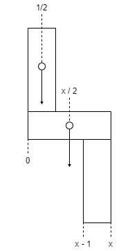
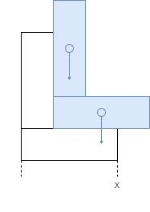

Doubles
=======

1. The L-tower problem
----------------------

.. admonition:: Introduction

	Observe the structures shown in Figure 1. One has 2 L-shapes, the other 5 L-shapes.
	Consider a tower with k L-shapes.
	Assume that the blocks are all of size :math:`x \times 1` where :math:`x > 1`.
	As the picture indicates, if k is too small then the tower falls to the left.
	On the other hand, if k is too large the tower would fall to the right.
	Will the tower be stable for some k?
	Prove there is at least one value of k for which the L-tower is stable.
	Assume that a structure is stable if and only if its center of gravity is not hanging in the air horizontally.
	The L-tower is stable if and only if each of its subparts is stable.

	*Hint*: Show the tower is stable if and only if :math:`{3x - 3 \over 2} \le k \le {3x - 1 \over 2}`.

	.. image:: ../images/L-tower.png
		:align: center

First, consider a single L-shape.

If we calculate from the bottom left corner being zero, its horizontal center of mass is an average of the two blocks.
The horizontal block has a center at :math:`{x \over 2}`.
The vertical block has a center at :math:`{1 \over 2}` since the block is defined as having a width of 1.

As an average this works out to;

.. math::

	\begin{aligned}

	c_1 &= {{x \over 2} + {1 \over 2} \over 2}

	c_1 &= {x + 1 \over 4}

	\end{aligned}

Now consider an L-shape above the first L-shape.

We can calculate the combined horizontal center of mass as follows;

.. math::

	\begin{aligned}

	c_2 &= {x \over 2} + {1 \over 2} + \big( 1 + {x \over 2} \big) + \big( 1 + {1 \over 2} \big)

	c_2 &= {x + 3 \over 4}

	c_2 &= c_1 + {1 \over 2}

	\end{aligned}

Note that center of mass has increased by :math:`{1 \over 2}` to the right.
Any L-shapes above the first one must have their combined center of mass less than or equal to x,
otherwise they will fall to the right.

In general, the center of mass for a k L-shape configuration, :math:`c_k`,
can be calculated as follows,

.. math::

	\begin{aligned}

	c_k &= {\sum^{k}_{i=1} (i - 1) + {x \over 2} + (i - 1) + {1 \over 2} \over 2k}

	&= {k \cdot \big( {x + 1 \over 2} \big) + [0, 1, 2, \dots, k - 1] \over 2k}

	&= {k \cdot \big ( {x + 1 \over 2} \big ) + k \cdot (k - 1) \over 2k}

	&= {{x + 1 \over 2} + k - 1 \over 2}

	&= {x + 1 \over 4} + {k - 1 \over 2}

	\end{aligned}

For the k L-shape not to fall to the left, the center of mass must not to be further left than the left edge of the initial vertical block,
and to not fall to the right the center of mass must not be further than the right edge.
This can be expressed as the condition,

.. math::

	x - 1 \le c_k \le x

An increase in k moves the center of mass :math:`{1 \over 2}` to the right,
so we can calculate :math:`c_{k - 1}` as,

.. math::

	c_{k - 1} = {x + 1 \over 4} + {k - 1 \over 2} - {1 \over 2}

For any stable k L-tower, we can then say

.. math::

	c_{k - 1} \le x - 1

	{x + 1 \over 4} + {k - 1 \over 2} - {1 \over 2} \le x - 1

	{x + 1 \over 4} + {k - 1 \over 2} \le x - {1 \over 2}

	c_k \le x - {1 \over 2}

This is a stricter upper bound on :math:`c_k`, which gives us,

.. math::

	x - 1 \le c_k \le x - {1 \over 2}

That can be solved for k as follows,

.. math::

	\begin{aligned}

	x - 1 &\le {x + 1 \over 4} + {k - 1 \over 2} &&\le x - {1 \over 2}

	x - 1 &\le {x + 2k - 1 \over 4} &&\le x - {1 \over 2}

	4x - 4 &\le x + 2k - 1 &&\le 4x - 2

	4x - 3 &\le x + 2k &&\le 4x - 1

	3x - 3 &\le 2k &&\le 3x - 1

	{3x - 3 \over 2} &\le k && \le {3x - 1 \over 2}

	\end{aligned}

We can then work out the difference between the upper and lowers bounds,

.. math::

	\begin{aligned}

	{3x - 1 \over 2} - {3x - 3 \over 2} &= 1

	{2 \over 2} &= 1

	\end{aligned}

If x is an odd integer, then stable values for k are the lower bound, the midpoint and the upper bound,
or :math:`\lbrack x - 1, x - {1 \over 2}, x \rbrack`,
because the bounds will evaluate to an even number, y.

.. math::

	\begin{aligned}

	y &= {3x - 3 \over 2}

	&= {3 \cdot odd - 3 \over 2}

	&= {odd - 3 \over 2}

	&= {even \over 2}

	&= even

	\end{aligned}

If x is anything else, however, then there are two stable values for k,
:math:`\lbrack y, z \rbrack`, where :math:`x - 1 < y < x - {1 \over 2}` and :math:`z = y + {1 \over 2}`.
