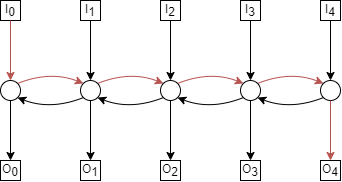
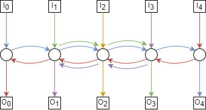
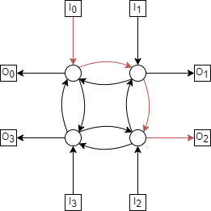
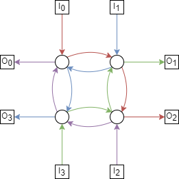
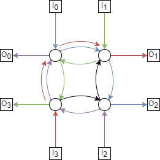

Networks
========

Analysis of Two Networks
------------------------

Two communication networks are shown below.
Complete the table of properties and be prepared to justify your answers.

.. list-table::

	* - .. image:: ../images/networks-5-path.png
	  - .. image:: ../images/networks-4-cycle.png

.. raw:: html

	

.. list-table::
	:widths: 20 20 20 20 20
	:header-rows: 1

	* - Network
	  - # Switches
	  - Switch Size
	  - Diameter
	  - Max Congestion
	* - 5-path
	  - 5
	  - :math:`3 \times 3`
	  - 6
	  - 5
	* - 4-cycle
	  - 4
	  - :math:`3 \times 3`
	  - 4
	  - 3

5-path
''''''

The diameter of the 5-path is 6, with the longer paths from :math:`I_0—O_4` as shown below;

The max congestion of the 5-path is 5, where we have the following permutation;

.. math::

	\begin{aligned}

	\pi(0) &= 4

	\pi(1) &= 3

	\pi(2) &= 2

	\pi(3) &= 1

	\pi(4) &= 0

	\text{this can also be} & \text{ expressed as,}

	\pi(i) &= 4 - i

	\end{aligned}

Every path will then have to pass through the central switch, as shown below;

There can't be congestion higher than 5, however, because there are only 5 paths.

4-cycle
'''''''

The diameter of the 4-cycle is 4 when taking the path from diagonally opposite inputs and outputs.
For example :math:`I_0—O_2`, as shown below,

The max congestion of the 4-cycle is 3, with the following permutation;

.. math::

	\begin{aligned}

	\pi(0) &= 2

	\pi(1) &= 3

	\pi(2) &= 0

	\pi(3) &= 1

	\end{aligned}

Each switch has at 3 inputs (2 from switches, 1 from terminal) and 1 output.
Suppose :math:`I_0`'s terminal input crosses through, as well as :math:`I_1` and :math:`I_2`'s.
:math:`I_3` is the last remaining terminal, but notice if we attempt to route through the switch adjacent to :math:`I_0`,
there is an unused route (coloured black below).

Since we always calculate congestion as the 'maximum minimum' congestion, this route wouldn't be chosen.
By symmetry, the same is true for any other terminal-adjacent switch.
Meaning a congestion greater than 3 is not possible on this network.
